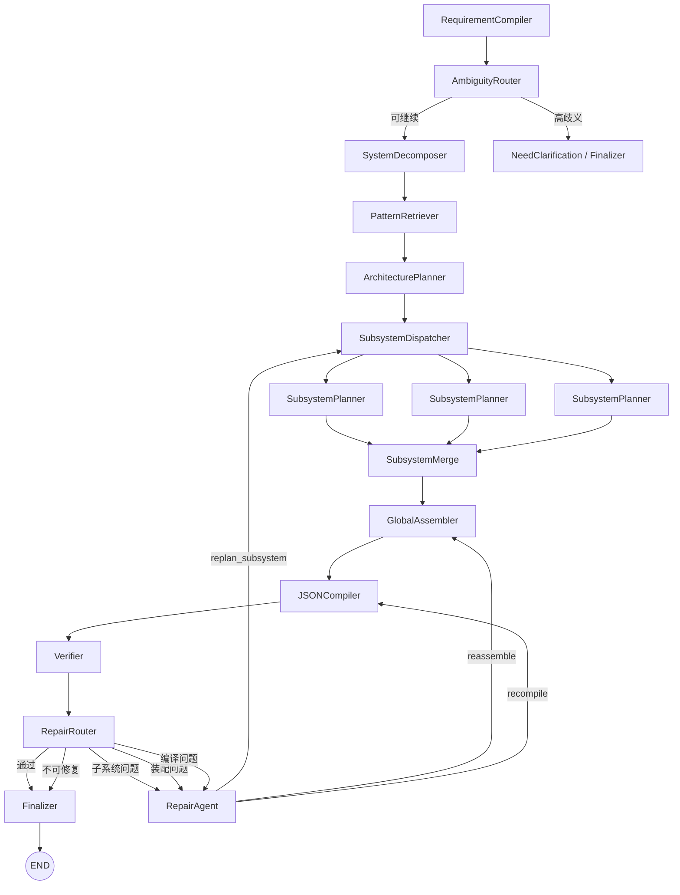

# LangGraph 工作流 V2 架构设计

> 基于 `docs/ahu/智能体优化思路.md` 进一步细化  
> 目标：把当前“Analysis -> Retrieval -> Planning -> Coding”的线性链路，升级为适合 AHU 复杂控制程序生成的工程编译式工作流

## 1. 评估结论

`智能体优化思路.md` 的方向判断是对的，而且抓住了当前系统最核心的短板：

1. 不是单纯“某个 Agent 不够强”，而是整条链路缺少工程层级、模板约束和校验闭环。
2. AHU 程序不是简单的模块拼接，而是系统骨架、子系统模板、原子模块、点位命名、页签组织、联锁规则共同作用的结果。
3. 复杂控制程序的中间产物不应是弱结构文本计划，而应是强约束 Graph IR。
4. 检索对象不能只停留在原子模块层，必须扩展到子流程模板和系统级案例骨架。
5. 生成后必须有专门的 Verification / Repair 回路，否则规模一大就会出现结构正确但工程不可用的情况。

我对原方案的进一步收束建议有 4 点：

1. 不是所有节点都应该是 LLM Agent。`GlobalAssembler`、`JSONCompiler`、大部分 `Verifier` 应该是确定性节点或规则优先节点。
2. 不建议一开始把 Planner 拆得过碎。V2 先拆成 `ArchitecturePlanner + SubsystemPlanner + GlobalAssembler` 三层就足够。
3. Repair 不应默认回退到最前面，而应按问题定位分流到 `subsystem / assembly / compile` 三个层级做局部修补。
4. 建议保留“案例骨架优先”的思路，但把它做成 `PatternRetriever` 的一个独立结果切片，而不是让 LLM 自己回忆类似结构。

因此，推荐的 V2 架构不是“更多节点的堆叠”，而是：

- 前端：把需求编译成工程语义规范
- 中端：分层检索、分层规划、全局装配
- 后端：确定性编译、规则校验、按作用域修补

## 2. 推荐的 LangGraph V2 节点架构

### 2.1 总体节点图



### 2.2 节点类型建议

| 节点 | 类型 | 建议实现方式 |
| --- | --- | --- |
| `RequirementCompiler` | LLM Agent | 结构化输出，生成工程语义规范 |
| `AmbiguityRouter` | Router | 规则节点，按歧义分流 |
| `SystemDecomposer` | Hybrid Agent | LLM + 规则，拆页签/子系统 |
| `PatternRetriever` | Retrieval Node | 多索引检索，返回模块/模板/案例骨架 |
| `ArchitecturePlanner` | LLM Agent | 生成系统级架构与约束 |
| `SubsystemDispatcher` | Router | 使用 LangGraph `Send` 并行派发 |
| `SubsystemPlanner` | LLM Agent | 子系统级 Graph IR 规划 |
| `SubsystemMerge` | Reducer | 合并并行子系统结果 |
| `GlobalAssembler` | Deterministic Node | 组装全局 Graph IR |
| `JSONCompiler` | Deterministic Node | 确定性编译为平台 JSON |
| `Verifier` | Rule-first Critic | 规则校验优先，必要时可补 LLM critic |
| `RepairRouter` | Router | 按 issue scope 决定修复回路 |
| `RepairAgent` | LLM Agent | 局部修补 IR 或编译参数 |
| `Finalizer` | Deterministic Node | 输出最终结果包 |

### 2.3 核心路由规则

| 路由点 | 条件 | 去向 |
| --- | --- | --- |
| `AmbiguityRouter` | `ambiguity_score <= threshold` | `SystemDecomposer` |
| `AmbiguityRouter` | `ambiguity_score > threshold` 且不允许保守假设 | `NeedClarification / Finalizer` |
| `SubsystemDispatcher` | `subsystems = [s1,s2,...]` | 为每个子系统派发一个 `SubsystemPlanner` |
| `RepairRouter` | `status = passed` | `Finalizer` |
| `RepairRouter` | `repair_scope = subsystem_plan` | `RepairAgent -> SubsystemDispatcher` |
| `RepairRouter` | `repair_scope = assembly` | `RepairAgent -> GlobalAssembler` |
| `RepairRouter` | `repair_scope = compile` | `RepairAgent -> JSONCompiler` |
| `RepairRouter` | `status = fatal` 或超出重试预算 | `Finalizer` |

## 3. V2 的核心数据流

### 3.1 数据产物链

```text
user_query
  -> requirement_spec
  -> decomposition_result
  -> retrieval_bundle
  -> architecture_plan
  -> subsystem_plan_map
  -> assembled_graph_ir
  -> compiled_artifact
  -> verification_report
  -> final_output
```

### 3.2 与现有 V1 的映射关系

| 当前字段 | V2 建议字段 | 说明 |
| --- | --- | --- |
| `analysis_result` | `requirement_spec` | 不再只存语义摘要，而是存工程语义规范 |
| `retrieval_context` | `retrieval_bundle` | 从单一模块检索结果升级为三层知识检索包 |
| `execution_plan` | `architecture_plan + subsystem_plan_map + assembled_graph_ir` | 从单一 plan 拆成三层 IR |
| `generated_code` | `compiled_artifact.json_text` | 明确其本质是“编译产物” |
| `validation_result` | `verification_report` | 从宽泛验证结果升级为结构化校验报告 |
| `debug_history` | `debug_history + repair_history` | 区分调试轨迹与修补轨迹 |

## 4. WorkflowState V2 设计

### 4.1 顶层状态建议

```python
class WorkflowStateV2(TypedDict):
    user_query: str
    request_meta: dict
    project_context: dict

    requirement_spec: dict
    ambiguity_status: dict
    decomposition_result: dict
    retrieval_bundle: dict

    architecture_plan: dict
    subsystem_plan_map: dict
    assembled_graph_ir: dict

    compiled_artifact: dict
    verification_report: dict
    repair_context: dict

    route_decision: dict
    retry_count: int
    retry_budget: dict
    debug_history: list
    repair_history: list

    current_step: str
    final_output: dict
```

### 4.2 字段分组设计

| 字段 | 类型 | 生产者 | 消费者 | 说明 |
| --- | --- | --- | --- | --- |
| `user_query` | `str` | 用户输入 | 全流程 | 原始需求文本 |
| `request_meta` | `dict` | 入口节点 | 全流程 | 请求 ID、时间戳、版本号、环境信息 |
| `project_context` | `dict` | 外部注入 | RequirementCompiler / Retriever | 项目风格锚点、已有模板、命名偏好 |
| `requirement_spec` | `dict` | RequirementCompiler | 后续全部节点 | 工程语义规范 |
| `ambiguity_status` | `dict` | RequirementCompiler | AmbiguityRouter / Finalizer | 歧义评分、是否允许保守假设 |
| `decomposition_result` | `dict` | SystemDecomposer | Retriever / ArchitecturePlanner | 页签、子系统、共享信号拆解结果 |
| `retrieval_bundle` | `dict` | PatternRetriever | Planner / Compiler / Verifier | 三层知识检索包 |
| `architecture_plan` | `dict` | ArchitecturePlanner | SubsystemPlanner / Assembler / Verifier | 系统骨架与全局约束 |
| `subsystem_plan_map` | `dict[str, dict]` | SubsystemPlanner / Merge | Assembler / RepairAgent | 每个子系统的局部 Graph IR |
| `assembled_graph_ir` | `dict` | GlobalAssembler | JSONCompiler / Verifier / RepairAgent | 全局图 IR |
| `compiled_artifact` | `dict` | JSONCompiler | Verifier / Finalizer | 编译产物、JSON 文本、ID 映射、布局报告 |
| `verification_report` | `dict` | Verifier | RepairRouter / RepairAgent / Finalizer | 错误、警告、修补建议、通过状态 |
| `repair_context` | `dict` | RepairAgent | RepairRouter / 后续节点 | 当前修补轮次、修补范围、patch 指令 |
| `route_decision` | `dict` | Router 节点 | 调试与审计 | 记录路由原因和目标 |
| `retry_count` | `int` | RepairRouter | 全流程 | 当前修补轮次 |
| `retry_budget` | `dict` | 初始化 | RepairRouter | 不同 repair scope 的最大重试次数 |
| `debug_history` | `list[dict]` | 全流程 | 调试/审计 | 每阶段摘要与指标 |
| `repair_history` | `list[dict]` | RepairAgent | 调试/审计 | 每次修补的目标和结果 |
| `current_step` | `str` | 全流程 | 调试/前端展示 | 当前节点标识 |
| `final_output` | `dict` | Finalizer | 输出 | 最终 JSON、报告、摘要 |

### 4.3 状态设计原则

1. 不再使用语义过宽的字段名，如 `analysis_result`、`execution_plan`。
2. 每个关键中间产物单独占一个字段，便于路由、缓存、局部修复和回放。
3. `retrieval_bundle`、`architecture_plan`、`assembled_graph_ir` 是 3 个关键断点，必须可单独持久化。
4. `compiled_artifact` 不仅保存 `json_text`，还要保存 `flow_objects / id_map / compile_report`，否则后续修补太难。

## 5. 关键中间 Schema

## 5.1 RequirementSpec

```json
{
  "schema_version": "2.0",
  "system_type": "AHU",
  "scenario_summary": "带送风机、冷水阀、电加热和CO2联动的AHU程序",
  "subsystems": [
    {
      "subsystem_id": "supply_fan_ctrl",
      "subsystem_type": "fan_control",
      "goal": "送风机启停、故障、可用性管理",
      "preferred_templates": ["ahu_supply_fan_std"],
      "page_hint": "控制",
      "priority": 1
    }
  ],
  "control_loops": [
    {
      "loop_id": "chw_temp_loop",
      "target": "送风温度",
      "pv_signal": "supply_air_temp",
      "sp_signal": "supply_air_temp_sp",
      "mv_signal": "chw_valve_cmd",
      "strategy": "PID",
      "constraints": ["output_limit", "manual_auto", "season_mode"]
    }
  ],
  "signals": {
    "inputs": [],
    "outputs": [],
    "software_points": [],
    "alarm_points": []
  },
  "required_pages": ["IO/通讯", "控制", "定时", "状态"],
  "global_modes": ["auto_manual", "summer_winter", "schedule_enable"],
  "ambiguities": [],
  "assumptions": [],
  "acceptance_criteria": [],
  "confidence": 0.0
}
```

### 5.2 DecompositionResult

```json
{
  "pages": [
    {"page_id": "page_control", "label": "控制", "purpose": "主控制与联锁"},
    {"page_id": "page_io", "label": "IO/通讯", "purpose": "硬件点与通讯映射"}
  ],
  "subsystem_descriptors": [
    {
      "subsystem_id": "supply_fan_ctrl",
      "page_id": "page_control",
      "implementation_preference": "reuse_subflow",
      "depends_on": [],
      "exports": ["sf_run_flag", "sf_fault_flag", "sf_available_flag"],
      "imports": ["schedule_enable"]
    }
  ],
  "shared_signal_registry": [],
  "template_needs": [],
  "planning_order": ["supply_fan_ctrl", "chw_valve_ctrl", "heater_ctrl"]
}
```

### 5.3 RetrievalBundle

```json
{
  "atomic_modules": [],
  "subflow_templates": [],
  "system_patterns": [],
  "style_guides": [],
  "metadata": {
    "selected_case_pattern_id": "",
    "retrieved_atomic_count": 0,
    "retrieved_subflow_count": 0,
    "retrieved_pattern_count": 0
  }
}
```

其中 3 类检索结果建议分别建索引：

| 切片 | 作用 |
| --- | --- |
| `atomic_modules` | 原子模块，如 `compare / pid / limit / logic / swInput / quote` |
| `subflow_templates` | 可复用子流程模板，如送风机标准控制、冷水阀控制、电加热 |
| `system_patterns` | 系统级骨架案例，如标准 AHU、AHU+CO2、AHU+排风 |

### 5.4 ArchitecturePlan

```json
{
  "goal": "生成AHU系统级骨架",
  "selected_pattern_id": "ahu_with_co2_v1",
  "pages": [
    {"page_id": "page_io", "label": "IO/通讯", "kind": "io"},
    {"page_id": "page_control", "label": "控制", "kind": "control"}
  ],
  "subsystem_slots": [
    {
      "subsystem_id": "supply_fan_ctrl",
      "page_id": "page_control",
      "binding_mode": "reuse_subflow",
      "candidate_template_ids": ["ahu_supply_fan_std"]
    }
  ],
  "global_signals": [],
  "naming_policy": {},
  "layout_policy": {},
  "structural_constraints": []
}
```

### 5.5 SubsystemPlan

```json
{
  "subsystem_id": "supply_fan_ctrl",
  "implementation_mode": "reuse_subflow",
  "template_binding": {
    "template_id": "ahu_supply_fan_std",
    "confidence": 0.93
  },
  "nodes": [
    {
      "logic_id": "sf_std_1",
      "module_type": "subflow:ahu_supply_fan_std",
      "parameters": {},
      "page_id": "page_control",
      "reasoning": "优先复用已有送风机标准控制模板"
    }
  ],
  "connections": [],
  "imported_signals": [],
  "exported_signals": [],
  "local_constraints": [],
  "validation_notes": []
}
```

### 5.6 AssembledGraphIR

```json
{
  "graph_ir_version": "2.0",
  "pages": [],
  "subflow_definitions": [],
  "node_instances": [],
  "quote_links": [],
  "signal_registry": [],
  "edges": [],
  "naming_policy": {},
  "layout_hints": {},
  "unresolved_items": []
}
```

建议把 `assembled_graph_ir` 设计为 4 层：

1. `pages`
2. `subflow_definitions`
3. `node_instances`
4. `edges / quote_links`

这样编译器和修补器都能定位问题，不需要回头重新理解全文本计划。

### 5.7 CompiledArtifact

```json
{
  "json_text": "[]",
  "flow_objects": [],
  "id_map": {},
  "layout_map": {},
  "compile_report": {
    "node_count": 0,
    "subflow_count": 0,
    "page_count": 0,
    "warnings": []
  }
}
```

### 5.8 VerificationReport

```json
{
  "status": "retryable_error",
  "repair_scope": "subsystem_plan",
  "issue_summary": "送风机控制缺少故障或可用性输出",
  "issues": [
    {
      "issue_id": "ISSUE-001",
      "severity": "error",
      "scope": "subsystem_plan",
      "target_id": "supply_fan_ctrl",
      "rule_id": "ahu.fan.must_have_fault_and_available",
      "message": "风机控制必须具备故障标志和可用标志",
      "suggested_fix": "优先绑定送风机标准控制子流程模板"
    }
  ],
  "warnings": [],
  "metrics": {
    "missing_required_inputs": 0,
    "isolated_nodes": 0,
    "invalid_port_refs": 0
  }
}
```

### 5.9 RepairContext

```json
{
  "repair_round": 1,
  "repair_scope": "subsystem_plan",
  "target_ids": ["supply_fan_ctrl"],
  "repair_strategy": "rebind_template",
  "patch_instructions": [
    "为 supply_fan_ctrl 绑定 ahu_supply_fan_std 模板",
    "补充 sf_fault_flag 和 sf_available_flag 导出"
  ]
}
```

## 6. 各 Agent 输入输出 Schema

## 6.1 RequirementCompiler

### 输入

| 字段 | 类型 | 必填 | 说明 |
| --- | --- | --- | --- |
| `user_query` | `str` | 是 | 用户自然语言需求 |
| `project_context` | `dict` | 否 | 项目风格锚点、已有模板、命名偏好 |
| `request_meta` | `dict` | 否 | 请求级元信息 |

### 输出

| 字段 | 类型 | 说明 |
| --- | --- | --- |
| `requirement_spec` | `RequirementSpec` | 工程语义规范 |
| `ambiguity_status` | `dict` | 歧义评分、需不需要澄清 |
| `current_step` | `str` | `requirement_compiled` |

### 输出重点

必须显式提取：

- 系统类型
- 子系统列表
- 控制回路表
- 全局模式
- 页签需求
- 联锁/报警/保护
- 模糊项与保守假设

## 6.2 SystemDecomposer

### 输入

| 字段 | 类型 | 必填 | 说明 |
| --- | --- | --- | --- |
| `requirement_spec` | `RequirementSpec` | 是 | 上游工程语义规范 |

### 输出

| 字段 | 类型 | 说明 |
| --- | --- | --- |
| `decomposition_result` | `DecompositionResult` | 页签、子系统、共享信号、规划顺序 |
| `current_step` | `str` | `system_decomposed` |

### 输出重点

- 不生成节点级连线
- 只拆系统骨架，不下沉到原子模块
- 明确每个子系统属于哪个页签、是否优先复用子流程

## 6.3 PatternRetriever

### 输入

| 字段 | 类型 | 必填 | 说明 |
| --- | --- | --- | --- |
| `requirement_spec` | `RequirementSpec` | 是 | 需求规范 |
| `decomposition_result` | `DecompositionResult` | 是 | 子系统和页签拆解 |
| `project_context` | `dict` | 否 | 项目风格或参考案例 |

### 输出

| 字段 | 类型 | 说明 |
| --- | --- | --- |
| `retrieval_bundle` | `RetrievalBundle` | 模块、子流程、系统骨架、风格包 |
| `current_step` | `str` | `patterns_retrieved` |

### 输出重点

- 至少返回 3 个切片：`atomic_modules / subflow_templates / system_patterns`
- 每个返回对象都要保留 `template_json / ports_definition / parameters_schema`
- 最好附带一个 `selected_case_pattern_id`

## 6.4 ArchitecturePlanner

### 输入

| 字段 | 类型 | 必填 | 说明 |
| --- | --- | --- | --- |
| `requirement_spec` | `RequirementSpec` | 是 | 需求规范 |
| `decomposition_result` | `DecompositionResult` | 是 | 系统拆解结果 |
| `retrieval_bundle.system_patterns` | `list` | 是 | 系统级骨架案例 |
| `retrieval_bundle.subflow_templates` | `list` | 是 | 子流程候选模板 |

### 输出

| 字段 | 类型 | 说明 |
| --- | --- | --- |
| `architecture_plan` | `ArchitecturePlan` | 页签骨架、子系统槽位、全局约束 |
| `current_step` | `str` | `architecture_planned` |

### 输出重点

- 决定哪些页签存在
- 决定哪些子系统优先走模板复用，哪些可以原子拼装
- 确定全局命名策略和布局策略

## 6.5 SubsystemPlanner

### 输入

| 字段 | 类型 | 必填 | 说明 |
| --- | --- | --- | --- |
| `requirement_spec` | `RequirementSpec` | 是 | 全局需求规范 |
| `architecture_plan` | `ArchitecturePlan` | 是 | 系统级骨架与约束 |
| `subsystem_descriptor` | `dict` | 是 | 当前子系统描述 |
| `retrieval_bundle.atomic_modules` | `list` | 是 | 原子模块白名单 |
| `retrieval_bundle.subflow_templates` | `list` | 是 | 子流程白名单 |

### 输出

| 字段 | 类型 | 说明 |
| --- | --- | --- |
| `subsystem_plan_map[subsystem_id]` | `SubsystemPlan` | 子系统局部 Graph IR |
| `current_step` | `str` | `subsystem_planned` |

### 输出重点

- 必须限制在当前子系统边界内规划
- 优先输出 `template_binding`
- 若不能命中模板，再退化为原子模块图
- 输出 imported / exported signals，供装配阶段使用

## 6.6 GlobalAssembler

### 输入

| 字段 | 类型 | 必填 | 说明 |
| --- | --- | --- | --- |
| `architecture_plan` | `ArchitecturePlan` | 是 | 系统骨架 |
| `subsystem_plan_map` | `dict[str, SubsystemPlan]` | 是 | 子系统局部 IR |
| `retrieval_bundle.style_guides` | `list` | 否 | 命名与布局风格约束 |

### 输出

| 字段 | 类型 | 说明 |
| --- | --- | --- |
| `assembled_graph_ir` | `AssembledGraphIR` | 全局图 IR |
| `current_step` | `str` | `graph_assembled` |

### 输出重点

- 解析跨子系统共享信号
- 生成 quote / software point / page 映射
- 保留未解决项到 `unresolved_items`

## 6.7 JSONCompiler

### 输入

| 字段 | 类型 | 必填 | 说明 |
| --- | --- | --- | --- |
| `assembled_graph_ir` | `AssembledGraphIR` | 是 | 全局图 IR |
| `retrieval_bundle` | `RetrievalBundle` | 是 | 模板与模块定义 |

### 输出

| 字段 | 类型 | 说明 |
| --- | --- | --- |
| `compiled_artifact` | `CompiledArtifact` | 平台 JSON 编译产物 |
| `current_step` | `str` | `json_compiled` |

### 输出重点

- 这个节点应尽量纯确定性
- 负责 ID 分配、坐标布局、模板填充、端口映射
- 不应重新理解自然语言需求

## 6.8 Verifier

### 输入

| 字段 | 类型 | 必填 | 说明 |
| --- | --- | --- | --- |
| `requirement_spec` | `RequirementSpec` | 是 | 回看原始工程需求 |
| `architecture_plan` | `ArchitecturePlan` | 是 | 验证骨架合理性 |
| `assembled_graph_ir` | `AssembledGraphIR` | 是 | 验证图结构 |
| `compiled_artifact` | `CompiledArtifact` | 是 | 验证编译结果 |

### 输出

| 字段 | 类型 | 说明 |
| --- | --- | --- |
| `verification_report` | `VerificationReport` | 错误、警告、修复建议、repair scope |
| `current_step` | `str` | `verified` |

### 校验维度

1. 结构一致性：页签、子流程、引用、孤立节点
2. 端口合法性：输入输出方向、端口索引、必需输入
3. 工程规则：风机故障/可用、PID 回路完整性、限幅、手自动
4. 风格一致性：命名规范、页签组织、布局密度

## 6.9 RepairAgent

### 输入

| 字段 | 类型 | 必填 | 说明 |
| --- | --- | --- | --- |
| `verification_report` | `VerificationReport` | 是 | 需要修补的问题列表 |
| `requirement_spec` | `RequirementSpec` | 是 | 不能偏离原始需求 |
| `architecture_plan` | `ArchitecturePlan` | 否 | 修补架构类问题时使用 |
| `subsystem_plan_map` | `dict` | 否 | 修补子系统问题时使用 |
| `assembled_graph_ir` | `dict` | 否 | 修补装配类问题时使用 |
| `compiled_artifact` | `dict` | 否 | 修补编译类问题时使用 |

### 输出

| 字段 | 类型 | 说明 |
| --- | --- | --- |
| `repair_context` | `RepairContext` | 修补策略与 patch 指令 |
| `architecture_plan / subsystem_plan_map / assembled_graph_ir / compiled_artifact` | `dict` | 仅更新对应 repair scope 的目标对象 |
| `current_step` | `str` | `repaired` |

### 输出重点

- 只修补，不重做全部规划
- 输出必须带 `repair_scope`
- 每次修补都要记录到 `repair_history`

## 7. 建议的 Graph IR 约束

如果 V2 只做一件最关键的事，我建议就是把 Graph IR 明确下来。最低限度应包含以下对象：

| 对象 | 必需字段 |
| --- | --- |
| `PageIR` | `page_id, label, kind, order` |
| `SubflowDefinitionIR` | `template_id, definition_id, io_contract, template_source` |
| `NodeInstanceIR` | `instance_id, logic_id, module_type, page_id, subflow_id, parameters` |
| `EdgeIR` | `from_instance, from_port, to_instance, to_port, signal_id` |
| `SignalIR` | `signal_id, semantic_role, source, targets, data_type, naming_hint` |
| `ConstraintIR` | `constraint_id, rule_id, level, target_ids, description` |

设计原则：

1. Planner 不直接输出最终 JSON。
2. Compiler 只消费 Graph IR，不消费自然语言。
3. Verifier 按 IR 做规则校验，按 scope 分类问题。

## 8. 推荐的实施顺序

### 第 1 阶段

先把当前工作流的 `execution_plan` 升级为 `assembled_graph_ir` 风格的强结构化 IR。

### 第 2 阶段

把检索库扩展成三层：

- 原子模块库
- 子流程模板库
- 系统骨架案例库

### 第 3 阶段

把 `PlanningAgent` 拆成：

- `ArchitecturePlanner`
- `SubsystemPlanner`
- `GlobalAssembler`

### 第 4 阶段

新增：

- `Verifier`
- `RepairAgent`
- `RepairRouter`

### 第 5 阶段

再考虑加入：

- 人工澄清节点
- 参数默认值策略库
- 规则库 DSL

## 9. 最终建议

这套 V2 设计的关键不是“让大模型更会写 JSON”，而是把 LangGraph 从“文本生成流水线”升级为“工程图编译流水线”。

如果用一句话概括新的设计目标，就是：

> 先把需求编译成工程语义，再基于案例骨架和模板约束分层规划，最后以 Graph IR 为中心完成确定性编译、规则校验和局部修补。

这比当前 V1 更长，但它更接近真实 AHU 项目的生成路径，也更适合后续支持：

- 多页签项目
- 子流程复用
- 模式切换与联锁
- 结构风格一致性
- 可回溯、可修补、可调试的工程生成流程

